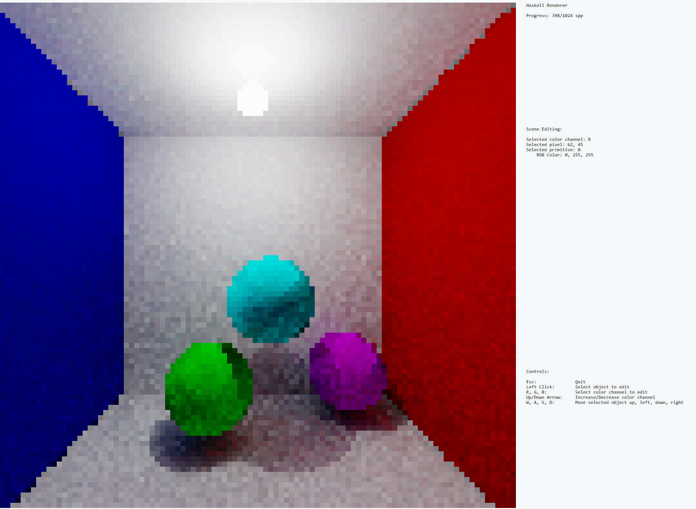

# haskell_raytracing



## Project Description: Implementing a Monte Carlo Path Tracing Renderer with Scene Editing in Haskell

We implemented a physically-based renderer within the terminal using Haskell. Ray tracing is a very classic computer graphics algorithm that renders a 3D scene to an image by simulating light rays scattering and bouncing within the scene, recording the light carried by the rays at pixels in the image. Ray tracing is naturally recursive, requires a set of abstract data types (ADT) like trees and maps and also needs to maintain rendering states, which makes this application a perfect testbed for functional programming.

The application takes in a scene description containing a camera configuration, lighting, and geometry. Typically, there are multiple different types of lights and geometric shapes, we will define type classes to handle different scene configurations in a uniform way. To simulate one light path scattering in the scene, we will trace a light ray from the light source, which reflects and refracts in the scene. Each reflection or refraction could lead to a new tracing event, which can be naturally implemented in recursive functions. To display the rendered image, we need to store the result of each light path in an image, which is the state that will be implemented using monads. Finally, we will show the results in a beautiful colored terminal UI with the help of the brick library.

To demonstrate interactivity, the user is able to edit the position and colors of objects in the scene, and the renderer will re-render the new objects interactively.

The controls are as follows:
* Esc:           Quit
* Left Click:    Select object to edit
* R, G, B:       Select color channel to edit
* Up/Down Arrow: Increase/Decrease the R/G/B color channel of the selected object
* W, A, S, D:    Move the selected object up, left, down, right

## Project Structure
To run the application, in the terminal run
```bash
cd BDPT
stack run
```

The core logic is implemented in:
* [BDPT/src/Lib.hs](/BDPT/src/Lib.hs): UI, controls, state, event loop
* [BDPT/src/Scene.hs](/BDPT/src/Scene.hs): Scene description, scene editing, rendering

## Acknowledgements
1. We referenced small code snippets from the following sources:
  * https://github.com/samtay/tetris/blob/master/src/UI/Game.hs: Used the code snippet to add a custom main which sends ticks to the event loop in brick
  * https://github.com/shajenM/projects/blob/master/towerHanoi/src/TowerAnimation.hs: Referenced how to use list comprehension (from `drawGrid` to build a grid of pixels)
  * https://github.com/jtdaugherty/brick/blob/master/docs/guide.rst: Setting up brick

Ray tracing is a standard algorithm, and we also referenced the text and non-haskell code at:
  * https://raytracing.github.io/ and https://www.pbr-book.org/: ray tracing algorithm
  * https://www.scratchapixel.com/lessons/3d-basic-rendering/minimal-ray-tracer-rendering-simple-shapes/ray-sphere-intersection.html: Ray sphere intersection algorithm

We also used the testing related files from the class assignments

2. Otherwise, we implemented the rest of the project ourselves, including rendering arbitrary rgb pixels in brick, rendering state, setting up the scene, deriving majority of the ray tracing/light transport math, adding object position and color editing.

## Team Members
- Hesper Yin
- Wesley Chang
- Xuanda Yang


## Milestone 2: Updates

### Architecture

our project includes two major key components: A user interface powered by the brick library to display the progression of our rendering algorithm, with a progress bar indicating how much work is to be done and sliders for users to adjust the rendered scene properties (For example users can interactively adjust the material of the object and see the rendering results reflect the changes). The user interface takes image buffers rendered by our bidirectional rendering algorithm and then rasterizes a fixed 40x40 image. The other major component is the bidirectional path tracer, which reads our pre-defined scene description, constructs light paths, traces light paths, and finally records the result. The two components have a clear producer-consumer relationship where the path tracer produces the image and the UI consumes it.

### Challenges so far:
- Designing the UI is challenging. We need to understand brick library's common patterns of building an app, so we spent time reading and learning from brick's official code samples and refined our code to render a demo scene in the command line.
- We need to design a scene that 1. be able to be rendered by our app. 2. have enough customization options so users can play around with it. We started with the classic cornell box scene (https://www.wikiwand.com/en/Cornell_box), perturbed the geometry and made one of the box metal-ish materials, which allows user to explore both diffuse and specular visual effects.
- Designing proper ADT for our bidirectional rendering algorithm. BDPT requires an explicit light path data structure, we need to carefully design this in a functional way.

### Do we expect to meet our goals until the deadline?
So far we expect to meet the goals until the deadline.
